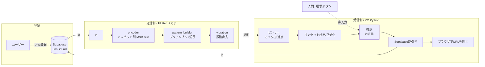

# VibeCode — 要件定義・技術構成

> システム全体（送信側・受信側・DB・プロトコル）を横断する設計ドキュメント。
> プロトコル定数の具体値は `PROTOCOL.md`、各実装方針は `CLAUDE.md` / `docs/INSTRUCTIONS_*.md` を正とする。
> 本ファイルは送信側・受信側の両リポジトリで共有する。

## 1. コンセプト
スマホの振動でURLを「送る」。URL本体ではなく、**Supabaseで割り当てた数値id**を短い/長い振動で送信し、受信側がidを復元してDBからURLを引いて開く。**体験の主役は手動演奏**: URLから生成された楽譜を画面に表示し、人間が「短/長」ボタンで演奏する（押すたびスマホが固定長の振動を発する）。自動演奏も併設する（デモ保険・受信チューニング基準）。
- 言葉遊び: vibe（雰囲気）× vibration（振動）× code（コード/譜面）。
- ハッカソン文脈（ハックツ）: 「技術の無駄遣い」が評価される。発表は **人間で体験 → 実は機械も読める（QRと同じ）** の二段構え。

## 2. 要件定義

### 2.1 利用シーン
- ラップトップにスマホを直置き（接触・近距離）。スマホが振動し、PCがそれを読み取ってブラウザでURLを開く。
- 同じ振動信号を、人間が「短/長」ボタンで打ち返しても読める。

### 2.2 機能要件
- **F1 URL登録**: URLを登録すると、システムが数値idを割り当ててSupabaseに保存する。
- **F2a 楽譜表示**: id から生成した短/長の並びを楽譜として表示し、演奏位置カーソルを出す（体験のコア）。
- **F2b 手動演奏**: 「短/長」ボタンで1打ずつ固定長の振動（150/450ms）を発する。プリアンブルは演奏開始時に自動送出。
- **F2c 自動演奏**: id をプリアンブル付き・MSB first で機械精度で一括再生する。
- **F3 振動受信/復調**: 受信側がセンサー（マイク／加速度等）で振動を検知し、id を復元する。
- **F4 逆引き&表示**: 復元した id で Supabase を逆引きし、対応URLをブラウザで開く。
- **F5 人間/機械 両対応**: 人間が「短/長」を手入力しても、機械の復調と同じ経路で id が復元される。
- **F6 UX演出**: 受信中はビット/idの形成を表示し、id解決後にURLをターミナル風にタイプ表示してから開く。
  - 注: id方式のため「タップ中にURLが伸びる」はできない（URLは逆引き後に確定）。演出は「入力中=id形成 → 解決後=URL表示」の順。

### 2.3 非機能要件
- **N1 プロトコル一致**: 送信・受信・人間入力のすべてが `PROTOCOL.md` の定数に一致する（唯一の正）。
- **N2 送信時間**: 1送信は実用的な時間に収める（目安 5〜7秒、idビット長に依存）。
- **N3 近接耐性**: 騒がしい会場でも直置き近接で復調できる（接触チャンネルでノイズ耐性を確保）。
- **N4 再現性**: 同じ id からは同じパターン。復号は決定的。必要に応じ誤り検出（パリティ/チェックサム）。
- **N5 送信側共通コード**: Android/iOS 共通コードで実機動作（プラットフォーム分岐なし）。
- **N6 デモ安定性**: 本番の送信機は1機種に固定し、受信チューニングを絞る。

### 2.4 スコープ
- **やる（ハッカソン範囲）**: id方式の送受信（手動演奏＋自動演奏）、楽譜表示、Supabase逆引き、基本UX演出。
- **stretch（本線完了後のみ）**: URL直接符号化モード（QR方式・自動演奏限定）。モードマーカー1bitはプロトコルに確保済み。
- **やらない**: 高度な誤り訂正、量産品質、セキュリティ硬化。

## 3. 技術構成

### 3.1 全体アーキテクチャ

### 3.2 コンポーネント
- **送信側（このリポジトリ / Flutter, Dart）**
  - `vibration` パッケージで短/長パターンを出力。Android（主）/ iOS（要Mac）。
  - 層: `constants` / `vibrator_service` / `pattern_builder`（プリアンブル付与）/ `encoder`（id→Pulse列）/ `main`(UI)。
- **受信側（別リポジトリ / Python）**
  - 音声/信号取得: `sounddevice`（マイク, 44.1kHz）。外付けIMU使用時は `pyserial`。
  - DSP: `numpy` / `scipy`（オンセット検出、バンドパス、正規化）。
  - 逆引き: Supabaseクライアント。URLオープン: `webbrowser`。
  - UI: ターミナル演出（`rich`/`textual`）または簡易GUI。
- **DB（Supabase / Postgres）**
  - テーブル例 `urls(id BIGINT PK, url TEXT, created_at)`。登録でid発行、受信側でid→url逆引き。
- **プロトコル**: `PROTOCOL.md` v1.0 確定（短長=0/1, MSB first, id=8bit固定, モードマーカー1bit, プリアンブル[700,200]×2, 150/450/150ms）。

### 3.3 センサー選定（受信側）
- **第一候補: PCマイク（44.1kHz）** — ハード不要・高帯域・立ち上がり速い。スマホ直置きで振動音を拾う。
- 補助/発表用: **外付けIMU（MPU6050等, 数百Hz〜1kHz, USBシリアル）** または **ピエゾ（接触マイク→音声入力）**。
- 検出律速はサンプリングレートではなく**モーター立ち上がり（最短パルス〜150ms）**。100Hz以上あれば検出は十分。

### 3.4 主要な技術選定理由
- id方式: 振動は帯域が細く、URL全体だと送信回数が膨大になるため、番号のみ送る。
- マイク優先: 加速度センサーより高帯域・低コスト・実装容易。ノイズ耐性が要る所だけ接触センサーで補強。
- 単一プロトコルファイル: 3者（送信・受信・人間）の定数ズレが致命的なため、`PROTOCOL.md` を唯一の正に集約。

## 4. 未決事項・リスク
- プロトコルは v1.0 で確定済み（id=8bit / 終端なし / プリアンブル[700,200]×2 / 150/450/150ms）。
- **リスク**:
  - Androidスマホ実機が未確保（送信の物理振動テストに必須）。iOSはMac必要。→ デモ送信機の確保を早めに。
  - プラットフォーム差（iOS Taptic vs Android ERM）で受信チューニングが変わる → 本番送信機を固定。
  - 長いidは累積タイミングずれでエラー増 → 10〜12ビット推奨 or 誤り検出付与。
  - 会場ノイズ → 直置き近接＋（必要なら）接触センサーで対処。

## 5. 役割分担・進行
- **送信側（担当: 別メンバー/Claude Code）**: M1 振動出力 → M2 id符号化 → M3 Supabase登録/id発行。
- **受信側（担当: 自分）**: センサー取得 → 復調 → Supabase逆引き → URLオープン → UX演出。
- **共有**: `PROTOCOL.md` は3人合意でのみ変更。結合テストは実機スマホ直置きで共同実施。

### 分岐前にやること
1. `PROTOCOL.md` の未決4項目を確定（特に id ビット長）。
2. デモ本番の送信機（Android/iOS どれか）を決定。
3. 送信側にドキュメント一式を渡し、受信側の開発を並行開始。
